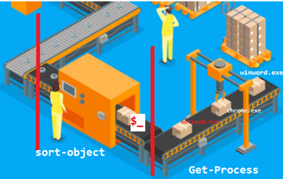

# PowerShell Pipelining and Aliases

## Pipelining

Pipelining in PowerShell is like an assembly line in a factory. Each cmdlet in the pipeline is a workstation, and the data flows through these workstations, being processed at each step.

### Assembly Line Analogy

Imagine a car manufacturing assembly line:

1. The first station (cmdlet) creates the car body (Get-Process retrieves all processes).
2. The next station (cmdlet) sorts the cars by size (Sort-Object arranges processes by CPU usage).
3. Another station paints the cars (ConvertTo-Html formats the data).
4. The final station packages the cars for shipping (Out-File saves the result to a file).

In this analogy, $_ or $PSItem is like a worker at each station. This worker knows exactly which car (or piece of data) they're working on at any given moment.

### One Item at a Time

It's crucial to understand that, like a real assembly line, PowerShell processes one item at a time through the entire pipeline. Even though we often see the final output as a complete set, each item (or "car" in our analogy) goes through the entire pipeline individually before the next one starts.

For example, in the command:

```powershell
Get-Process | Where-Object { $_.CPU -gt 10 } | Select-Object Name, CPU
```




PowerShell does the following:
1. Gets the first process
2. Checks if its CPU usage is greater than 10
3. If yes, selects its Name and CPU properties
4. Moves to the next process and repeats steps 1-3

This happens for each process, one at a time, even though we see the results all at once at the end. This sequential processing is efficient and allows for handling large datasets without consuming excessive memory.

### Pipeline Variables: $_ and $PSItem


In PowerShell pipelines, you often need to refer to the current object being processed. There are two special variables for this purpose: $_ and $PSItem. Both serve the same function and can be used interchangeably.

- $_ : This is the traditional syntax, inherited from other scripting languages.
- $PSItem : This is a more descriptive, PowerShell-specific alias for $_.

These variables represent the current object in the pipeline. They're particularly useful in cmdlets like Where-Object, ForEach-Object, and Select-Object.

Example using $_:
```powershell
Get-Process | Where-Object { $_.CPU -gt 10 } | Select-Object Name, CPU
```

The same example using $PSItem:
```powershell
Get-Process | Where-Object { $PSItem.CPU -gt 10 } | Select-Object Name, CPU
```

Both of these commands will return processes with CPU usage greater than 10, showing only the Name and CPU properties.

Using $_ or $PSItem is a matter of personal preference. $_ is more concise, while $PSItem is more descriptive and self-documenting. Choose the one that makes your code most readable to you and your team.

### Basic Example:

```powershell
Get-Process | Sort-Object -Property CPU -Descending | ConvertTo-Html | Out-File ProcessesByCPU.html
```

This pipeline does the following:
1. `Get-Process`: Retrieves all running processes
2. `Sort-Object -Property CPU -Descending`: Sorts the processes by CPU usage in descending order
3. `ConvertTo-Html`: Converts the sorted list into HTML format
4. `Out-File ProcessesByCPU.html`: Saves the HTML output to a file

After running this command, you'll have an HTML file named ProcessesByCPU.html in your current directory. Open it in a web browser to see a nicely formatted table of processes sorted by CPU usage.

### Commonly Used Cmdlets in Pipelines

Here are some of the most frequently used cmdlets in pipelines:

1. **Select-Object**: Selects specified properties of an object.
   Example:
   ```powershell
   Get-Process | Select-Object Name, CPU, WorkingSet
   ```

2. **Where-Object**: Filters objects based on specified criteria.
   Example:
   ```powershell
   Get-Process | Where-Object { $_.CPU -gt 10 }
   ```

Other important cmdlets for pipeline operations include:
- ForEach-Object
- Sort-Object
- Group-Object
- Measure-Object

We'll dig more into these later, but these cmdlets form the backbone of many PowerShell operations and are crucial for effective data manipulation and analysis.

### Practical Exercise:

Let's create a pipeline to identify large files in your Downloads folder:

```powershell
Get-ChildItem $env:USERPROFILE\Downloads |
    Where-Object { $_.Length -gt 100MB } |
    Select-object Name, Length , Fullname -first 10|
    ConvertTo-Html |
    Out-File LargeDownloads.html
```


This pipeline:
1. Gets all items in your Downloads folder
2. Filters for files larger than 100MB
3. Selects the Name, Length and Fullname and limits the output to 10
4. Converts to HTML and saves the result for Reporting

> Note: `$env:USERPROFILE` is an environment variable in PowerShell. Environment variables are prefixed with `$env:` in PowerShell. `USERPROFILE` specifically points to the current user's profile folder (typically C:\Users\YourUsername). So, `$env:USERPROFILE\Downloads` refers to your Downloads folder.

After running this, open LargeDownloads.html in your browser to see which large files are taking up space in your Downloads folder.

## Basic Flow Control

PowerShell provides several cmdlets for flow control, allowing you to manage the flow of your scripts.
we will look at it in more detail later, but here is a quick overview with foreach and if statement.

Conditional Logic with If in PowerShell
In PowerShell, the if statement is used to control the flow of a script by executing code only when specific conditions are met. 
It evaluates a condition, and if it's $true, the code inside the braces {} is executed. You can also use elseif and else to handle additional cases.

Basic Syntax

```powershell
if (<condition>) {
    <code to execute if condition is true>
} elseif (<another condition>) {
    <code to execute if this condition is true>
} else {
    <code to execute if none of the above conditions are true>
}
```

```powershell

### ForEach-Object

The `ForEach-Object` cmdlet is used to iterate over each item in a collection and execute a specified block of code for each item.


Get-Process | ForEach-Object {
    if ($_.WorkingSet -gt 104857600) {  # 100MB in bytes
        Write-Host "$($_.Name) is using more than 100 MB of memory" -ForegroundColor Red
    } elseif ($_.WorkingSet -gt 52428800) {  # 50MB in bytes
        Write-Host "$($_.Name) is using between 50 and 100 MB of memory" -ForegroundColor Yellow
    } else {
        Write-Host "$($_.Name) is using less than 50 MB of memory" -ForegroundColor Green
    }
}
```


## Aliases

Aliases in PowerShell are shortcuts or alternate names for cmdlets. 
They allow for quicker typing and can make command-line operations more efficient.

Some common aliases include are well known to keep dos/linux experience:
- `ls` or `dir` for `Get-ChildItem`
- `cd` for `Set-Location`
- `cls` for `Clear-Host`

You can view all aliases using the `Get-Alias` cmdlet.

### Quick Exercise:

Try to find out what `?` and `%` mean in PowerShell. These are aliases for commonly used cmdlets in pipelines.

Hint: Use `Get-Alias ?` and `Get-Alias %` to discover their meanings.

While aliases are great for interactive use, it's generally recommended to use full cmdlet names in scripts for better readability and maintainability.


In future lessons, we'll explore essential PowerShell discovery commands like Get-Help, Get-Command, and Get-Member. These will help you understand cmdlet parameters, find relevant commands, and explore object properties, enhancing your ability to construct effective PowerShell commands and pipelines.
