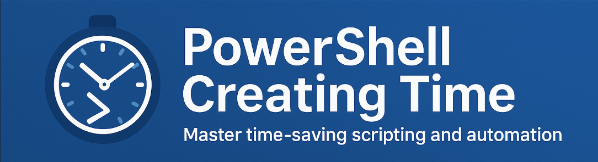

  

Welcome to the PowerShell Training course focused on Creating Time. This comprehensive program is designed to help you master PowerShell skills that will save you time and increase your productivity in your daily tasks.

---

##  Course Overview

**Two main concepts we want to teach:**

-  **Understanding the Shell. The Pipeline.**
-  **Learning the Language. Understanding Objects Oriented.**
-  **As a summary project, we will create a script that will automate a task**

---

##  Introduction

- [📚 About the Course](intro/aboutcourse/about.md)
- [🤖 The Future of IT in the Age of AI](intro/thefutureofit.md/futureofit.md)
- [🛠️ Evaluating Some Tools](intro/tools/evaluatingsometools.md)
- [🗣️ Debate](intro/debate/debate.md)

---

##  Part 1: Understanding the Shell

0. [ >_ - What is PowerShell?](part1/whatispowershell/whatispowershell.md)
1. [🔢 -  PowerShell Versions](part1/PowershellVersions/index.md)
2. [⚡ - Cmdlets 100](part1/Cmdlets100/index.md)
3. [⚡ - Cmdlets 101](part1/Cmdlets101/index.md)
4. [📦 - Modules](part1/modules/modules.md)
5. [❓ - Get-Help](part1/Get-Help/gethelp.md)
6. [🔗 - PipeLines](part1/PipeLiningAlias/pipeline.md)
7. [⭐ - The Every Day Use cmdlets](part1/TheParetoCmdlets/paretocmdlets.md)
8. [🧮 - Calculated Properties](part1/CalculatedProperties/calculatedProperties.md)
9. [🗄️ - Provider](part1/registryProvider/regproviders.md)
10. [🌐 - Remoting and Rest Methods](part1/remoting/remoting.md)
11. [➕ - Operators](part1/operators/powershell_operators.md)
12. [📝 - Practice Exercises](part1/PracticeExercises/UserParameters/index.md)

---

##  Part 2: Learning the Language

1. [🔤 - PowerShell Variables and Data Types](part2/variableslogic101/variablelogic.md)
2. [📚 - Arrays](part2/arrays/arrays.md)
3. [🏗️ - Object-Oriented Programming](part2/objectoriented/objectoriented.md)
4. [🔍 - Get-Member](part2/get-member/getmember.md)
5. [🔁 - Flow Control](part2/flowcontrol/flowcontrol.md)
6. [⏰ - Get-Date](part2/getdate/getdate.md)

---

##  Part 3: Creating Your Own Scripts

1. [📜 -  Creating a Function](part3/functions/functions.md)
2. [🏁 -  Creating a Script](part3/scripts/howtoscript.md)

---

