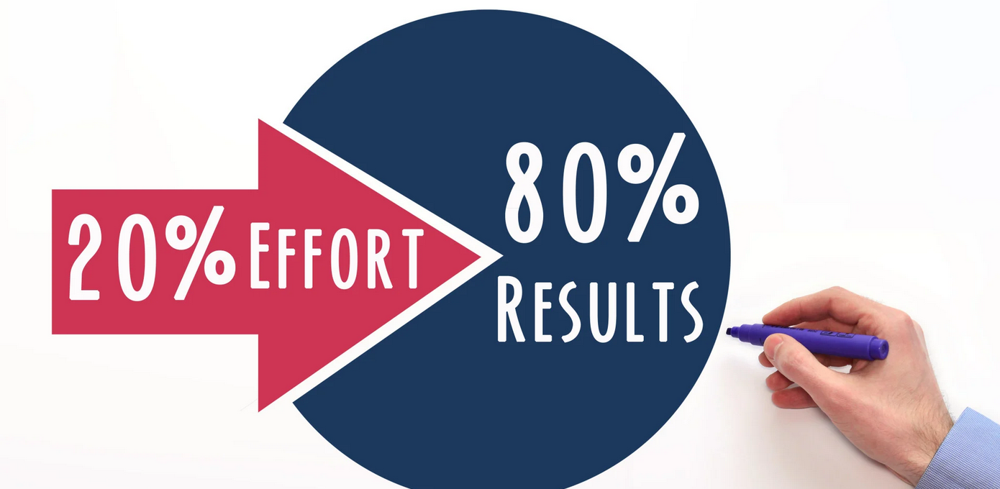

# Our Training Approach: The Pareto Principle in Action

  

## The 80/20 Rule
The Pareto Principle states that roughly 80% of effects come from 20% of causes. 
In our PowerShell training we want to focus on the 20%  that will bring you the most value.

📚 Pareto Principle (Click to expand)

The Pareto Principle named after Vilfredo Pareto's observation that 80% of Italy's land was owned by just 20% of the population. His personal observations extended to his garden, where he noticed that 20% of his pea pods produced 80% of the peas.

This distribution pattern has since been observed across numerous fields:
- **Business**: 20% of customers generate 80% of revenue
- **Agriculture**: 20% of plants yield 80% of crops
- **Software**: 80% of users only use 20% of features
- **Productivity**: 20% of our efforts produce 80% of our results
- **Project Management**: 20% of project defects cause 80% of problems

These patterns consistently demonstrate how a vital few inputs drive the majority of outputs, making the principle invaluable for prioritization and resource allocation.

- 20% of PowerShell most important cmdlets you'll be solving 80% of your daily tasks
- Learning these core cmdlets (like `Get-Command`, `Get-Help`, `Get-Member`)
- Understanding the Pipeline and the 

- 80% of your scripts will use just 20% of coding patterns

## A Colleague's Perspective

I'm not approaching this as a traditional teacher but as your colleague from UMB.

My goal is to share practical, real-world experience as i have been working with PowerShell for over 10 years and also within UMB a similar number of years.

## Project-Based Learning

This training isn't just about learning a list of commands and syntax.
Lets try to get something useful. 
We'll work towards creating a practical project that you can:

- Implement in your Team or your daily work.
- Customize for your specific needs
- Use as a foundation for future automation

## Coaching

As within 2 day we can not cover everything, we can schedule a follow up session to continue on your project.

## Orgainzation 

we will do a 5-10 min break every 1-1.5 hours.
lunch break will be at 11.30 - 12.30.
Course will finish at arround 17.00

