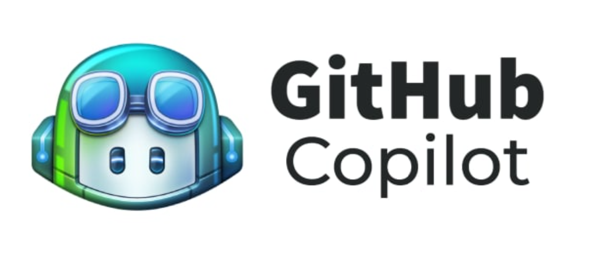

## AI Tools for Coding: Enhancing Developer Productivity

- LLMs (Large Language Models) excel in programming contexts:
  - Programming languages are "closed domains" with well-defined rules. LLMs can effectively learn and apply these rules

This would be a whole long discussion, and i would like jus to focus on these two tools: Copilot and Q.

  
  

- Various AI-powered tools are revolutionizing the coding landscape:

   GitHub Copilot:
     - AI pair programmer that suggests code completions
     - Integrates directly into popular IDEs
     - Learns from context and comments to generate relevant code

   Amazon Q:
     - AI-powered assistant for AWS developers
     - Helps with code generation, debugging, and AWS-specific tasks
     - Provides explanations and best practices.

