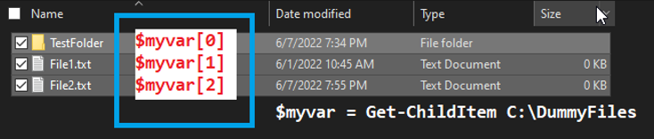

# Arrays in PowerShell

## What is an Array?

An array in PowerShell is a data structure that stores a sequential collection of elements of any type. It's essentially a collection of objects.

## Defining an Array

You can define an array in PowerShell using several methods:

1. Using comma-separated values:
   ```powershell
   $myArray = "apple", "banana", "cherry"
   ```

2. Using the array subexpression operator `@()`:
   ```powershell
   $myArray = @("apple", "banana", "cherry")
   ```


## Array Operations

### Accessing Array Elements

Let's consider a scenario where we have a folder containing two directories and one file:
- TestFolder (directory)
- File1.txt (file)
- File2.txt (file)

We can use `Get-ChildItem` to get these items and store them in an array:

```powershell
$myArray = Get-ChildItem C:\ExampleFolder
````

Now, `$myArray` contains these items as an array. You can access individual elements of this array using their index (starting from 0):

```powershell
$myArray[0] # Returns the TestFolder directory object
$myArray[1] # Returns the File1.txt file object
$myArray[2] # Returns the File2.txt file object
````



Each element in the array is an object:
- `$myArray[0]` is a DirectoryInfo object
- `$myArray[1]` and `$myArray[2]` are FileInfo objects

You can access properties of these objects. For example:

```powershell
$myArray[0].Name    # Returns "TestFolder"
$myArray[1].Name    # Returns "File1.txt"
$myArray[2].Name    # Returns "File2.txt"
````


## Conclusion

Arrays in PowerShell are versatile and powerful. They allow you to work with collections of data efficiently, whether you're dealing with strings, numbers, or complex objects. Practice working with arrays to become more proficient in PowerShell scripting.


## Exercises

Try these exercises to reinforce your understanding of arrays in PowerShell:

### Exercise 1: Create and Manipulate an Array

1. Create an array called `$fruits` with the following items: "apple", "banana", "orange", "grape", "kiwi".
2. Print the entire array.
3. Print the third item in the array.
4. Add "mango" to the end of the array.
5. Remove "banana" from the array.
6. Print the updated array and its length.

<details>
<summary>Click to see solution</summary>

```powershell
# 1. Create the array
$fruits = @("apple", "banana", "orange", "grape", "kiwi")

# 2. Print the entire array
$fruits

# 3. Print the third item
$fruits[2]

# 4. Add "mango" to the end
$fruits += "mango"

# 5. Remove "banana"
$fruits = $fruits | Where-Object { $_ -ne "banana" }

# 6. Print updated array and length
$fruits
$fruits.Length
```
</details>


## A Note on Collections

While we're focusing on arrays, it's worth mentioning that PowerShell also supports collections. Collections, like arrays, are used to store multiple items, but they offer more flexibility. Unlike arrays, which have a fixed size once created, collections (such as ArrayList or List<T>) can dynamically grow or shrink. They often provide additional methods for adding, removing, and manipulating elements. For example:

```powershell
$fruitList = [System.Collections.ArrayList]@("apple", "banana", "cherry")
$fruitList.Add("date")  # Adds an item
$fruitList.Remove("banana")  # Removes an item
```
Collections are particularly useful when you need to frequently modify the contents of your data structure. However, for many scripting tasks, arrays are sufficient and often simpler to use.